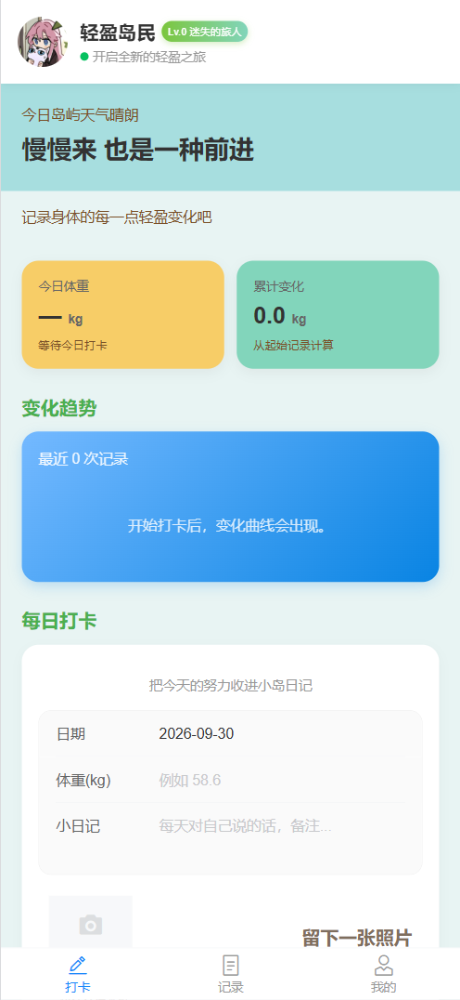
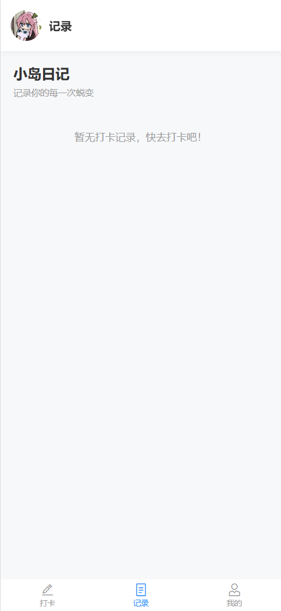
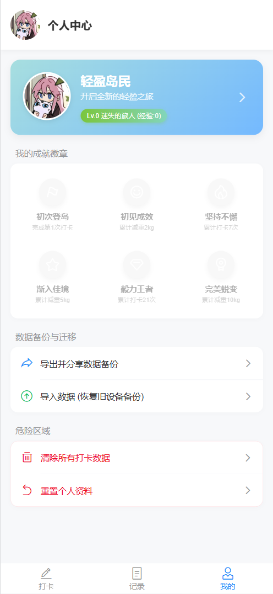
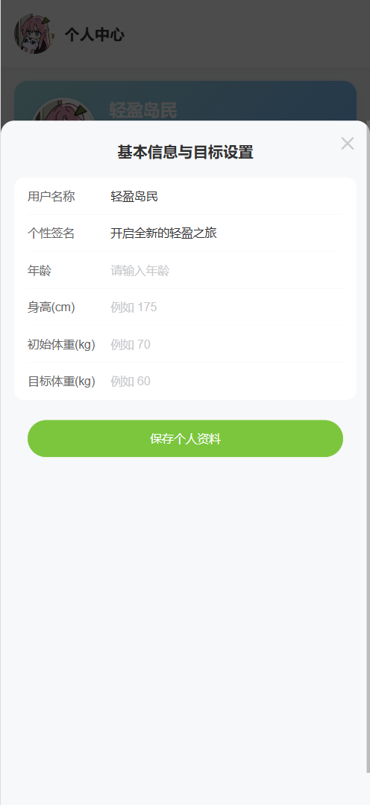

<!-- PROJECT LOGO -->

<p align="center">
  
</p>

<h1 align="center">轻盈小岛</h1>

<p align="center">
  <strong>一款打卡记录减肥数据的“国民级”App</strong><br>
  <em>安全 永久免费 开源 无广告</em>
  <br />
    <a href="https://github.com/Ax-NET-02/lightweight-island/issues/new?labels=bug&template=bug-report---.md">提交你发现的Bug</a>
    ·
    <a href="https://github.com/Ax-NET-02/lightweight-island/issues/new?labels=enhancement&template=feature-request---.md">提出你的需求/想法</a>
</p

</div>

## 关于本App

<p align="center">
  
  
</p>
<p align="center">
  
  
</p>

#### 还在用「微信文件传输助手」、「手机自带笔记」记录自己的体重吗？

#### 这些记录起来不但麻烦，还容易记混，如果你也有这些烦恼，那不妨试试，这款“国民级”App，轻盈小岛值得你拥有！

#### 问：主包，主包数据会不会泄露？

#### 答：体重、照片等数据都是存在您手机本地的，不用担心数据泄露哦~

#### 问：主包，主包我怎么知道你软件有没有被你植入恶意木马，有没有在软件留后门

#### 答：代码都在这，实在不放心，您可以自己构建编译打包，请放心食用！

### 妈妈再也不怕我被猪精上身了！

## 食用方法

#### 在[官方网站](https://)下载APK安装包或者在该项目[Releases](https://github.com/Ax-NET-02/lightweight-island/releases)下载APK安装包，授权安装即可

1. 打开软件后，先点击「我的」，点击头像可以修改默认头像，点击头像右边的「>」按钮，修改个人信息
2. 再点击打卡，就可以愉快的记录你的体重数据了
3. 点击记录，这里记录你所有的打卡数据

### 正常用户读到这里就可以了，下面是项目介绍，以及自己构建编译打包的方法

## 项目实现****

### 技术栈：

- vue3 + TypeScript + Vite
- UI组件：Vant3

## 项目构建

### 环境准备：

- JDK17
- Node
- Android Studio

### 拉取项目

- 直接[下载](https://github.com/Ax-NET-02/lightweight-island/archive/refs/heads/main.zip)项目包
- 解压到你喜欢的位置，从项目中打开终端

### 安装项目依赖

```powershell
npm install
```

### 构建前端静态资源

```powershell
npm run build
```

### 添加 Android 平台

```powershell
npx cap add android
```

### 同步配置与资源

```powershell
npx cap sync
```

### 打开 Android Studio

```powershell
npx cap open android
```

### 等待 Gradle 自动同步

- ##### 等Android Studio下面进度条跑完

### 执行 APK 打包命令

* 将鼠标移到顶部菜单栏，点击 **Build**（构建）
* 在下拉菜单中，将鼠标悬停在 **Generate App Bundles or APKs**上
* 在弹出的子菜单中，点击选择 **Generate APKs**

### 打包完成

- ##### 等待一段时间，右下角提示打包完成之后，点击右侧的 **locate** 蓝字，跳转到打包文件
- ##### 完整文件路径

  ```powershell
  lightweight-island\android\app\build\outputs\apk\debug
  ```

## 贡献

##### 如果您有好的建议，请创建分支（Fork）本仓库并且创建一个拉取请求（Pull Request）

##### 您也可以简单地创建一个议题（Issue），并且添加标签「Enhancement」

##### 不要忘记给项目点一个 Star⭐！再次感谢！

1. ##### 复刻（Fork）本项目
2. ##### 创建你的 Feature 分支 (git checkout -b feature/AmazingFeature)
3. ##### 提交你的变更 (git commit -m 'Add some AmazingFeature')
4. ##### 推送到该分支 (git push origin feature/AmazingFeature)
5. ##### 创建一个拉取请求（Pull Request）

<!-- LICENSE -->

## 许可证

##### 根据 [Apache-2.0 license](https://github.com/Ax-NET-02/lightweight-island/tree/main?tab=Apache-2.0-1-ov-file#) 许可证分发。打开 `LICENSE` 查看更多内容

<!-- CONTACT -->

## 联系

[Ax-NET](https://mail.google.com/) - xiaodian021@gmail.com
